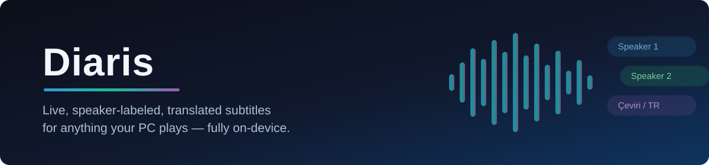
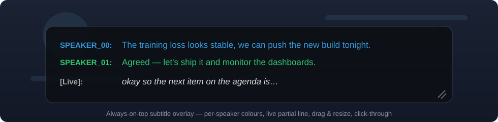
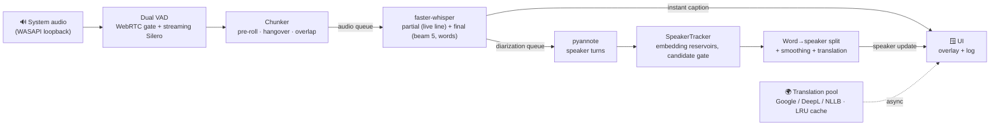

<div align="center">



<br/>

**Live, speaker-labelled, translated subtitles for anything your PC plays.**

Captures Windows system audio (WASAPI loopback) → transcribes it with **faster-whisper** →
figures out **who is speaking** with pyannote + a custom streaming speaker tracker →
**translates** on the fly → renders it as a draggable on-screen overlay.

<br/>

[](https://www.python.org/)
[](#requirements)
[](#requirements)
[-41CD52?logo=qt&logoColor=white)](#the-interface)
[](LICENSE)
[](https://github.com/astral-sh/ruff)

<br/>

[Features](#features) •
[How it works](#how-it-works) •
[Quick start](#quick-start) •
[Configuration](#configuration) •
[Benchmarks](#evaluation--benchmarks) •
[Architecture](#project-layout)

<br/>



</div>

---

## Why this exists

Meeting recorders listen to your microphone. **Diaris listens to your computer.**
It taps the system's audio output directly — no virtual cables, no acoustic loss — so any
YouTube video, livestream, podcast, lecture, or video call becomes a live, colour-coded,
per-speaker transcript, optionally translated into your language in real time. Everything
runs locally on your machine (translation can be fully offline too).

## Features

|     | Feature | Details |
|-----|---------|---------|
| 🎧 | **System-audio capture** | WASAPI loopback with automatic device detection — follows your default speakers/headphones, zero hard-coded device names |
| ⚡ | **Real-time ASR** | faster-whisper (CTranslate2) with word-level timestamps; auto-selects `whisper-medium` on GPU, `small` on CPU; runs several times faster than real time |
| 🗣️ | **Streaming speaker diarization** | pyannote 3.1 turns + a custom cross-chunk **SpeakerTracker**: warm-up clustering, per-speaker embedding reservoirs, candidate confirmation gate, self-correcting merge — "Speaker 1" stays the same person for the whole session |
| 🌍 | **Live translation** | Google / DeepL / fully-offline NLLB-200 (CTranslate2), pluggable, LRU-cached, and **off the latency-critical path** |
| 🪟 | **Subtitle overlay** | Frameless, translucent, always-on-top, draggable & resizable, optional click-through, stable per-speaker colours |
| 🖥️ | **Control panel + tray** | Bilingual (EN/TR) PySide6 dashboard: device picker, language pair, theme, font/opacity — keeps running from the system tray |
| 🚿 | **Hallucination filtering** | Confidence-based gates + blocklist so silence and music don't become "Thank you for watching." |
| ⏱️ | **Latency-engineered** | Provisional-then-final pipeline at three levels (partial→final, source→translation, text→speaker), bounded partial decodes, backpressure, model warm-up |
| 📊 | **Research-grade evaluation** | The *same* production pipeline is scored on CHiME-6 / AMI / LibriSpeech / FLORES-200 with WER, CER, cpWER, DER — plus a live latency/RTF benchmark |
| 🔌 | **Fully local** | Models download once from Hugging Face; after that the ASR + diarization stack needs no internet |

## How it works



The pipeline is **provisional-then-final** at every level, which is what makes it feel
instant *and* accurate:

1. A cheap **partial** transcription paints the flickering live line within ~300 ms.
2. When the utterance ends, the **final** transcript replaces it immediately — in the source language.
3. The **translation** arrives a beat later as an in-place update (never blocking audio processing).
4. **Diarization** runs in its own thread and retro-labels the same segment with real speakers,
   splitting Whisper segments at true speaker boundaries using word timestamps.

Three details do a lot of heavy lifting for accuracy:

- **The VAD never rewrites audio.** It only decides chunk *boundaries*; the raw signal
  (including natural pauses) always reaches Whisper intact.
- **Pre-roll & overlap-with-trim.** 240 ms of pre-speech audio protects word onsets; forced
  mid-speech cuts carry 480 ms into the next chunk as context and trim it from the output —
  no clipped words, no duplicates.
- **Reservoir speaker matching.** Each speaker is modelled by their last 8 high-quality
  embeddings rather than one fragile centroid, with a confirmation gate that stops one-off
  sounds from becoming phantom speakers.

## Quick start

### Requirements

- **Windows 10/11** (WASAPI loopback is Windows-specific)
- **Python 3.10+**
- NVIDIA GPU with CUDA — *optional but recommended* (CPU works with `whisper-small` + int8)
- A free [Hugging Face token](https://huggingface.co/settings/tokens) for the pyannote models

### Install

```bash
git clone https://github.com/diarisdev/diaris.git
cd diaris
python -m venv .venv
.venv\Scripts\activate
pip install -r requirements.txt -c constraints-windows.txt
```

Create your config and add your Hugging Face token:

```bash
copy .env.example .env
```

Accept the model licences on Hugging Face (one click each), then download everything:

- [pyannote/speaker-diarization-3.1](https://huggingface.co/pyannote/speaker-diarization-3.1)
- [pyannote/segmentation-3.0](https://huggingface.co/pyannote/segmentation-3.0)
- [pyannote/wespeaker-voxceleb-resnet34-LM](https://huggingface.co/pyannote/wespeaker-voxceleb-resnet34-LM)

```bash
python scripts/download_models.py
```

This fetches **faster-whisper**, the **pyannote segmentation + embedding** models, and the
**NLLB-200** offline translation model into `models/` (git-ignored).

### Run

```bash
python main.py          # GUI: control panel + subtitle overlay + tray
python main.py --cli    # headless terminal mode (Ctrl+Q to stop)
```

Pick your audio source and language pair in the control panel, hit **Start**, and play
anything. Captions appear in the overlay; the full log stays in the panel.

## Configuration

Everything is tuned through `.env` (see [`.env.example`](.env.example) for the annotated
full list). The knobs that matter most:

| Variable | Default | What it does |
|---|---|---|
| `HF_TOKEN` | — | Hugging Face token (**required** for model download) |
| `WHISPER_MODEL` | *(auto)* | Whisper folder under `models/`; empty = `whisper-medium` on GPU, `whisper-small` on CPU |
| `WHISPER_LANGUAGE` | `en` | Transcription language |
| `TRANSLATION_ENGINE` | *(auto)* | `google` \| `deepl` \| `ctranslate2`; empty = DeepL key → local NLLB → Google |
| `VAD_AGGRESSIVENESS` | `2` | WebRTC gate strictness (0–3) |
| `VAD_USE_WEBRTC` | `true` | Disable to let Silero decide alone (A/B it with `scripts/vad_webrtc_ablation.py`) |
| `SILERO_THRESHOLD` | `0.70` | Neural VAD speech-confidence threshold |
| `DIARIZATION_EMBEDDING_THRESHOLD` | `0.66` | Speaker-match cosine threshold — the main diarization knob |
| `DIARIZATION_WARMUP_MS` | `20000` | Initial calibration window for speaker clustering |

<details>
<summary><b>All tuning knobs</b> (chunking, latency, speaker gating)</summary>
<br/>

| Variable | Default | Description |
|---|---|---|
| `SILENCE_LIMIT` | `30` | Silence frames (×30 ms) that end an utterance |
| `SHORT_SILENCE_LIMIT` | `15` | Tighter limit once a chunk is already long |
| `SOFT_CHUNK_DURATION_MS` | `5000` | After this, the tighter silence limit applies |
| `MAX_CHUNK_DURATION_MS` | `10000` | Hard cap on chunk length |
| `PRE_ROLL_MS` | `240` | Pre-speech audio prepended to each chunk (onset protection) |
| `CHUNK_OVERLAP_MS` | `480` | Context carried across forced mid-speech cuts (trimmed from output) |
| `PARTIAL_WINDOW_MS` | `4000` | Buffer tail decoded for the live line (finals always see the full chunk) |
| `CANDIDATE_CONFIRMATIONS_NEEDED` | `2` | Consistent sightings required before a new speaker is created |
| `CANDIDATE_TTL` | `15` | Chunks an unconfirmed speaker candidate survives |
| `CANDIDATE_SELF_SIMILARITY` | `0.78` | Minimum self-consistency among a candidate's embeddings |
| `MIN_NEW_SPEAKER_DURATION` | `2.0` | Clean-speech seconds required to be eligible as a new speaker |
| `WHISPER_NO_SPEECH_THRESHOLD` | `0.6` | Hallucination gate: no-speech probability |
| `WHISPER_LOGPROB_THRESHOLD` | `-1.0` | Hallucination gate: average log-probability |
| `WHISPER_COMPRESSION_RATIO_THRESHOLD` | `2.4` | Hallucination gate: repetitive-gibberish ratio |
| `SAVE_AUDIO_FILE` | `false` | Also save the whole session as a WAV |
| `DEEPL_API_KEY` | — | Enables the DeepL engine |

</details>

## The interface

| Component | What you get |
|---|---|
| **Control panel** | Device picker (auto-refreshing loopback list), source/target languages, light/dark theme, overlay font size & opacity, speaker-colour toggle, live transcription log — fully bilingual UI (English/Türkçe) |
| **Subtitle overlay** | Glass-morphic always-on-top window, drag anywhere, resize from the corner, click-through mode so it never steals your mouse, last few lines with stable per-speaker colours and a live italic partial line |
| **System tray** | Close the panel and it keeps transcribing; tray menu for show/toggle-overlay/quit, icon reflects recording state |

## Evaluation & benchmarks

The `tests/` tree scores the **actual production pipeline** — not a research fork — against
standard corpora, with all metric math in one shared module (`tests/metrics`): WER, CER,
**cpWER** (Hungarian speaker assignment, optional [meeteval](https://github.com/fgnt/meeteval)
reference implementation), and **DER** (pyannote.metrics, with overlap-excluded variants).

```bash
# AMI: replay meetings through the real live path, then score DER/WER/cpWER
python -m tests.benchmarks.ami_replay --only IS1009a
python -m tests.benchmarks.ami_score  --only IS1009a

# Sweep the speaker-matching threshold and get a comparison report
python scripts/ami_threshold_sweep.py

# CHiME-6 (dinner-party audio, Track-2 streaming)
python -m tests.benchmarks.chime6 --session S02 --mode worn --segmentation streaming

# Clean-speech ASR + translation quality
python -m tests.benchmarks.librispeech_asr --limit 20
python -m tests.benchmarks.translation --pairs en-tr --limit 100

# Live latency / RTF / peak CPU-RAM-VRAM while you play real audio
python -m tests.benchmarks.live_performance --seconds 60
```

Current ballpark on commodity hardware: **RTF well under 0.3×** (several times faster than
real time) with sub-second caption latency; on AMI meetings the streaming pipeline scores
around **31% WER** with `whisper-small` (drops further with `whisper-medium`). CHiME-6 is a
famously hostile benchmark — see the docstrings in `tests/benchmarks/` for how to read those
numbers fairly.

## Project layout

```
diaris/
├── main.py                     # entry point (GUI / --cli)
├── src/
│   ├── config.py               # all settings (.env-driven, frozen dataclass)
│   ├── pipeline.py              # capture loop, chunking state machine, worker threads
│   ├── audio/
│   │   ├── device.py            # WASAPI loopback auto-detection
│   │   ├── vad.py               # WebRTC + streaming Silero, anti-aliased resampler
│   │   ├── preprocessing.py     # mono/normalize/resample (cached kernels)
│   │   └── utils.py
│   ├── core/
│   │   ├── ai_worker.py         # Whisper + pyannote orchestration, hallucination filter
│   │   ├── speaker_tracker.py   # cross-chunk speaker identity (reservoirs + gating)
│   │   ├── embedding_extractor.py
│   │   ├── diarization_utils.py # word→speaker assignment (pure Python)
│   │   └── formatting.py
│   ├── translation/             # Google / DeepL / NLLB engines + LRU cache
│   └── ui/                      # PySide6 panel, overlay, tray, speaker palette
├── scripts/                     # model downloader, VAD & threshold sweeps, GSS
├── tests/
│   ├── unit/                    # fast pytest suite (no models needed)
│   ├── metrics/                 # single source of WER/CER/cpWER/DER math
│   ├── dataset_managers/        # AMI / CHiME-6 / LibriSpeech / FLORES-200
│   └── benchmarks/              # heavy evaluation runners
└── models/                      # local model weights (git-ignored)
```

## Development

```bash
pip install -r requirements-dev.txt
pytest -m "not slow and not requires_model"   # fast unit tests
pytest                                        # full suite
ruff check .
```

Contributions are welcome — the test README (`tests/README.md`) explains exactly where a
new dataset, metric, or benchmark belongs so the structure stays clean.

## Acknowledgements

This project stands on excellent open-source work:
[faster-whisper](https://github.com/SYSTRAN/faster-whisper) ·
[pyannote.audio](https://github.com/pyannote/pyannote-audio) ·
[Silero VAD](https://github.com/snakers4/silero-vad) ·
[WebRTC VAD](https://github.com/wiseman/py-webrtcvad) ·
[NLLB-200](https://ai.meta.com/research/no-language-left-behind/) ·
[CTranslate2](https://github.com/OpenNMT/CTranslate2) ·
[PyAudioWPatch](https://github.com/s0d3s/PyAudioWPatch)

## License

[MIT](LICENSE) — do whatever you like, attribution appreciated.
